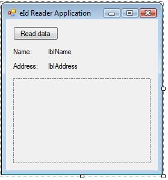

# Accessing the Belgian Identity Card from VB.NET

## Introduction

By August of 2009 every citizen in Belgium that is at least 12 years old is required to carry an eletronic identity card. This step-by-step article discusses the steps you need to take in order to read data from such a card from .NET.

I programmed this somewhere in the winter of 2006 in Borland [CodeGear](http://www.codegear.com/) Delphi. Since then I've switched my environment to .NET and this seemed like an interesting bit of code to migrate.

The language of choice in this article is VB.NET, but it is easily translatable to C#. And there are more than enough examples of how to access the Belgian identity card using C# out there on the net.

Due to the article's length I have choosen to divide it into three parts. In the first part, I'll be describing the general things you have to do in order to retrieve the data from the card. In the second part you'll see how you can monitor the status of a smartcard reader so that you can detect when a card is inserted or ejected from the reader and in the third and final part we will combine the code from the previous parts to create a simple and reusable class.

Let's get started, then...

## Your Development Environment

In order to develop applications using the eletronic Belgian Identity Card, you'll need to install a minimum set of software components. The minimum requirements are the following:

- Visual Studio 2005 or 2008 (Enterprise, Professional or Standard)
- [Belgium Idendity Card Runtime](https://eid.belgium.be/en)

Obviously you'll also need one particular piece of hardware, namely a smartcard reader. I recommend the ACR38u reader which is readily available for about 15 - 20 Euros at your local supermarket or computerstore.

On the Belgium Identity Card Runtime website you'll need to download the Beid runtime. The latest version to date is 2.6. It comes in three flavors: Windows, Mac OS or Linux. Ofcourse the choice here is obvious. You'll also find an SDK and developer's guide here, which pretty much tells you everything you need to know. The original code written in Delphi was based on the information found in this guide.

## A Quick Tour Of The eId Middleware

The Belgian Electronic Identity Card (Belgian eId) is a smartcard containing all the information about a person's identity such as his or her address, first and last name, picture...etc. Besides that it also contains certificates which allow each citizen to be uniquely authenticated and to produce digital signatures to sign documents for example.

For now we'll only be focussing on retrieving the basic information from the card and not on the more sophisticated features offered by the certificates. That would take us beyond the scope of this article.

In the sections that follow I will show you how to make a basic application that reads the address, first and last name and picture of an eId card. The communication between our example project and the card is handled by the forementioned Belgium Idendity Card Runtime.

This article guides you through the steps on how to access this middleware (the eId runtime) in order to read the data from the card. If you follow along with these steps you'll have a really simple yet functional application.

Personally I prefer reading articles that allow you to code alongside them while you read on. So without further ado let's get down to the basics.

## Creating The Solution

Start Visual Studio and create a new blank solution (File ► New Project). A New Project dialog is presented, choose the template Blank Solution (File ► Other Project Types ► Visual Studio Solutions ► Blank Solution). Name it BelgianEIdSolution. You can ommit the root namespace or name it BelgianIdentityCardReader. To keep it simple I have ommitted this root namespace and just redeclared in every file as you can see from the code examples. Feel free to make up your own namespaces.

Next add a Class Library project to this blank solution. You can do this by right clicking on the solution in the Solution Explorer and choosing "Add ►New Project" from the context menu. Again a New Project dialog is presented, choose the template Class Library here (Visual Basic ►Windows ►Class Library) and name it BelgianIdentityCardReader. This produces a DLL assembly which you'll later reference from your host application which is a regular Windows Form application.

## Invoking The Middleware

The middleware provides a Dynamic Link Library called beidlib.dll which you'll find under the System32 folder in the Windows folder. This DLL exposes the functionality you need to address in order to successfully retrieve any data from the card.

You can use the API's exposed by the eId runtime by using the Platform Invoke (PInvoke) interoperability mechanism. Since marshalling is involved to move arguments between managed and unmanaged code you'll have to pay attention to this when passing parameters to and receving results from these API's.

The beidlib.dll library exposes the following functions:

- **BEID_Init** This function initializes the eId runtime, it must be called before any other one.
- **BEID_Exit** This function cleans up all the data used by the runtime. Make sure to call it at the end of your application to make sure everything is neatly disposed of.
- **BEID_GetID** Retrieves the entire identity from the card. This contains data such as the first and lastname, the birthdate, sex, chipnumber, nationality...etc.
- **BEID_GetAddress** Like the previous function this one is pretty much self-explanatory, namely it retrieves the address.
- **BEID_GetPicture** Loads the picture from the card which is stored in the JPEG format.

This list is by no means exhaustive. These five functions make up the high level part of the eId library. The library contains many other functions for the mid and low levels, but I've chosen to only list those that you need to achieve your goal. The developer's guide which you can download alongside the Belgian eId runtime lists all of the contained functions if you're interested in experimenting with them.

Before you create a wrapper for the high level API's let's first add a NotInheritable (sealed for the C# crowd) class to house some global constants which you'll be using throughout this article. Add a new Class (.vb) to the Class Library and name it GlobalConstants. Listing 1 shows the code for this class.

**Listing 1** - GlobalConstants.vb File which contains global contants

```vbnet
Namespace BelgianIdentityCardReader

    'Static holder types should be NotInheritable
    Public NotInheritable Class GlobalConstants

#Region "Hidden constructor"
        'Static holder types should not have constructors.
        'Hide the default constructor by making it
        'private.
        Private Sub New()
        End Sub
#End Region

#Region "Dll constants"
        Public Const EIdLibDll As String = "BEIDLIB.DLL"
        Public Const Kernel32Dll As String = "KERNEL32.DLL"
#End Region
    End Class

End Namespace
```

Now let's get started on that wrapper. Add a new Class to the Class Library and name it UnsafeNativeMethods. Listing 2 shows the entire code for this class.

**Listing 2** - UnsafeNativeMethods.vb File which wraps the high level API's

```vbnet
Imports System.Runtime.InteropServices

Namespace BelgianIdentityCardReader

    Partial Friend NotInheritable Class UnsafeNativeMethods

#Region "BEIDLib.DLL Version Constants"

        'Changes each time the interface is modified
        Private Const INTERFACE_VERSION As Short = 2
        'Stays until incompatible changes in existing functions.
        'Typically, this is not updated when functions are added.
        Private Const INTERFACE_COMAT_VERSION As Short = 1

#End Region

#Region "Hidden constructor"
        'Static holder types should not have constructors.
        'Hide the default constructor by making it
        'private.
        Private Sub New()
        End Sub
#End Region

#Region "High Level API"

        Friend Shared Function Connect(ByVal readerName As String, ByVal ocsp As PolicyOption, _
                                       ByVal crl As PolicyOption, ByRef cardHandle As IntPtr) As Status
            Return InitEx(readerName, ocsp, crl, cardHandle, INTERFACE_VERSION, INTERFACE_COMAT_VERSION)
        End Function

        <DllImport(GlobalConstants.EIdLibDll, EntryPoint:="BEID_InitEx", CharSet:=CharSet.Ansi, _
                   BestFitMapping:=False, ThrowOnUnmappableChar:=True, SetLastError:=True)> _
        Private Shared Function InitEx(ByVal readerName As String, _
                                       ByVal ocsp As PolicyOption, ByVal crl As PolicyOption, _
                                       ByRef cardHandle As IntPtr, ByVal interfaceVersion As Integer, _
                                       ByVal interfaceCompVersion As Integer) As Status
        End Function

        <DllImport(GlobalConstants.EIdLibDll, EntryPoint:="BEID_Exit", SetLastError:=True)> _
        Friend Shared Function Disconnect() As Status
        End Function

        <DllImport(GlobalConstants.EIdLibDll, EntryPoint:="BEID_GetID", SetLastError:=True)> _
        Friend Shared Function GetId(ByRef data As IdData, ByRef CertificateCheck As CertificateCheck) As Status
        End Function

        <DllImport(GlobalConstants.EIdLibDll, EntryPoint:="BEID_GetAddress", CharSet:=CharSet.Ansi)> _
        Friend Shared Function GetAddress(ByRef Address As Address, ByRef CertificateCheck As CertificateCheck) As Status
        End Function

        <DllImport(GlobalConstants.EIdLibDll, EntryPoint:="BEID_GetPicture", SetLastError:=True)> _
        Friend Shared Function GetPicture(ByRef picture As Bytes, ByRef check As CertificateCheck) As Status
        End Function

#End Region

    End Class

End Namespace
```

Platform Invocation methods such as these marked with <DllImport> should be defined in a class named NativeMethods, SafeNativeMethods or UnsafeNativeMethods. These classes should be declared as a Friend (internal), and hide their constructor by making it private to prevent new instances from being created. The methods in these classes should be Friends (internal) and Shared (Static). They are only known within in your Class Library assembly.

The only exception to this rule is the InitEx method, I've made this private and wrapped it in the Connect method. The reason for this is that the two last parameters of the InitEx method always have the same value namely the version numbers of the eId API. These are passed by the Connect method so that you don't have to worry about those anymore.

As you can see in the code of listing 2 there are some undefined types such as PolicyOption, Status, IdData, CertificateCheck, Address and Bytes. These are all new structures that are used in order to communicate with the eId API. As mentioned earlier you have to make sure these are marshalled correctly when you access unmanaged code from managed code. The code for each of these structures will be listed in the following sections.

## Initializing And Finalizing The eId Runtime

The first order of business before you can retrieve any data from an electronic identity card is to initialize the eId runtime. This is done by calling the BEID_Init() API. This call is wrapped in the Shared Connect method of the UnsafeNativeMethods class.

If you are to call this method then you have to declare the structure PolicyOption since you have to pass this two times as an input parameter. Each of the eId API's also returns a structure called Status as its return value. This structure contains a number of fields which inform you about the status of the called API. Let's begin with declaring this structure, add a new Code File to your project and names it Status. Listing 3 shows you its contents.

**Listing 3** - Complete Status.vb File

```vbnet
Imports System.Runtime.InteropServices

Namespace BelgianIdentityCardReader

    Public Enum ErrorCode
        None = 0
        System = 1
        PCSC = 2
        Card = 3
        BadParameter = 4
        Internal = 5
        InvalidHandle = 6
        InsufficientBuffer = 7
        CommunicationError = 8
        Timeout = 9
        UnknownCard = 10
        KeypadCanceled = 11
        KeypadTimeout = 12
        KeypadPinMismatch = 13
        KeypadMessageTooLong = 14
        InvalidPinLength = 15
        Verification = 16
        NotInitialized = 17
        Unknown = 18
        UnsupportedFunction = 19
        IncorrectVersion = 20
        InvalidRootCertificate = 21
        Validation = 22
    End Enum

    <StructLayout(LayoutKind.Sequential)> _
    Public Structure Status
#Region "Member Fields"
        'General return code
        <MarshalAs(UnmanagedType.I4)> _
        Private mGeneral As ErrorCode
        'System error
        <MarshalAs(UnmanagedType.I4)> _
        Private mSystem As Integer
        'PC/SC error
        <MarshalAs(UnmanagedType.I4)> _
        Private mPCSC As Integer
        'Card status Word
        <MarshalAs(UnmanagedType.I2)> _
        Private mCardSW As Short
        'Reserved for future use
        <MarshalAs(UnmanagedType.I2)> _
        Private mRFU1 As Short
        <MarshalAs(UnmanagedType.I2)> _
        Private mRFU2 As Short
        <MarshalAs(UnmanagedType.I2)> _
        Private mRFU3 As Short
#End Region

#Region "Properties"
        Public ReadOnly Property General() As ErrorCode
            Get
                Return Me.mGeneral
            End Get
        End Property

        Public ReadOnly Property System() As Integer
            Get
                Return Me.mSystem
            End Get
        End Property

        Public ReadOnly Property PCSC() As Integer
            Get
                Return Me.mPCSC
            End Get
        End Property

        Public ReadOnly Property CardSW() As Short
            Get
                Return Me.mCardSW
            End Get
        End Property
#End Region
    End Structure

End Namespace
```

As you can see the Status structure contains a bunch of error codes which are returned by the eId API. Most of the structures passed to the eId API also conclude with a certain number of bytes which are reserved for future use. You can recognize these by the RFU ("Reserved For Future Use") abbreviation. Most of the fields in this structure are marshalled as signed 2-byte or 4-byte integers. Consult the developer's guide if you want to find out how to marshal the other eId structures.

For the purpose of this article the only errorcode I'm interested in is the General return code. The other errorcodes are dependant on this one, if the general errorcode is non-zero then one of the sub errorcodes will have a value. Above the Status structure you'll see an enumeration which declares the possible error codes.

You could choose to only expose this general errorcode field through a property but that would later on result in a "Signature not compatible with PInvoke" exception. PInvoke needs access to the member fields through the properties if the structure is to be marshalled correctly. When it comes to result variables PInvoke is stricter with this than when it comes to the parameters you supply.

Now on to the PolicyOption structure. Add a new Code File to the project and name if PolicyOption. Listing 4 shows the complete code for this file.

**Listing 4** - Complete PolicyOption.vb File

```vbnet
Imports System.Runtime.InteropServices

Namespace BelgianIdentityCardReader

    'OCSP and CRL Policy option
    Public Enum PolicyOption
        'CRL Policy is not used
        None = 0
        'CRL Policy is optional
        Elective = 1
        'CRL Policy is mandatory
        Mandatory = 2
    End Enum

End Namespace
```

The values for the OCSP en CRL policy options which you pass to the Connect method influence the policy concerning certificate validation. Since we won't be using the certificates you can just pass PolicyOption.None (= 0). When these are both equal to 0, the certificates are not read for all further function calls. This speeds up the reading.

Now you have all the necessary code to call the Connect method and initialize the eId runtime. Since the Disconnect method which cleans up the eId runtime has no input parameters and also returns the Status structure you can also call this. You are now setup to commence reading data from the card.

## Reading The Identity

Now you can finally start retrieving data from the card. Let's start with the identity. This is done with the Shared GetId method of the UnsafeNativeMethods class. Let's take a look at its declaration.

**Listing 5** - The GetId method

```vbnet
<DllImport(GlobalConstants.EIdLibDll, EntryPoint:="BEID_GetID", SetLastError:=True)> _
Friend Shared Function GetId(ByRef data As IdData, ByRef CertificateCheck As CertificateCheck) As Status
End Function
```

Looking at the input parameters of this method you can see that you need to declare two additional structures. The first structure IdData is used by the eId API to return the identity data, you can see that it is passed by reference. The second one CertifcateCheck is included in each function that returns signed data such as the identity, address or the picture. You are not going to need it, but you still need to provide it.

But before you declare these two structures it is best to declare another tidbit of code first. The IdData and CertificateCheck structures internally use some constants to declare the length of certain fields, mainly strings which are X characters in size. The boundaries of the structures need to be marshalled correctly if you want to receive the data in an orderly fashion from the eId API's. To do this add a new module to the BelgianIdentityCardReader project and name it FieldContants. The complete is shown below in Listing 6.

**Listing 6** - Complete FieldConstants.vb File

```vbnet
Namespace BelgianIdentityCardReader

    Module FieldConstants
        Public Const MAX_CARD_NUMBER_LEN As Short = 12
        Public Const MAX_CHIP_NUMBER_LEN As Short = 32
        Public Const MAX_DATE_BEGIN_LEN As Short = 10
        Public Const MAX_DATE_END_LEN As Short = 10
        Public Const MAX_DELIVERY_MUNICIPALITY_LEN As Short = 80
        Public Const MAX_NATIONAL_NUMBER_LEN As Short = 11
        Public Const MAX_NAME_LEN As Short = 110
        Public Const MAX_FIRST_NAME1_LEN As Short = 95
        Public Const MAX_FIRST_NAME2_LEN As Short = 50
        Public Const MAX_FIRST_NAME3_LEN As Short = 3
        Public Const MAX_NATIONALITY_LEN As Short = 3
        Public Const MAX_BIRTHPLACE_LEN As Short = 80
        Public Const MAX_BIRTHDATE_LEN As Short = 10
        Public Const MAX_SEX_LEN As Short = 1
        Public Const MAX_NOBLE_CONDITION_LEN As Short = 50
        Public Const MAX_DOCUMENT_TYPE_LEN As Short = 2
        Public Const MAX_SPECIAL_STATUS_LEN As Short = 2
        Public Const MAX_HASH_PICTURE_LEN As Short = 20
        Public Const MAX_STREET_LEN As Short = 80
        Public Const MAX_STREET_NR As Short = 10
        Public Const MAX_STREET_BOX_NR As Short = 6
        Public Const MAX_ZIP_LEN As Short = 4
        Public Const MAX_MUNICIPALITY_LEN As Short = 67
        Public Const MAX_COUNTRY_LEN As Short = 4
        Public Const MAX_RAW_ADDRESS_LEN As Short = 512
        Public Const MAX_RAW_ID_LEN As Short = 1024
        Public Const MAX_PICTURE_LEN As Short = 4096
        Public Const MAX_CERT_LEN As Short = 2048
        Public Const MAX_CERT_NUMBER As Short = 10
        Public Const MAX_CERT_LABEL_LEN As Short = 256
        Public Const MAX_SIGNATURE_LEN As Short = 256
        Public Const MAX_CARD_DATA_LEN As Short = 28
        Public Const MAX_CARD_DATA_SIG_LEN As Short = MAX_SIGNATURE_LEN + MAX_CARD_DATA_LEN
        Public Const MAX_CHALLENGE_LEN As Short = 20
        Public Const MAX_RESPONSE_LEN As Short = 128
        Public Const MAX_PINS As Short = 3
        Public Const MAX_PIN_LABEL_LEN As Short = 256
    End Module

End Namespace
```

Now that you have this trivial bit of code out of the way you can add a new VB Code File to the BelgianIdentityCardReader project and name it IdData. This structure contains a bit of code, the complete code for the IdData.vb file is shown in Listing 7.

**Listing 7** - Complete IdData.vb File

```vbnet
Imports System.Runtime.InteropServices

Namespace BelgianIdentityCardReader

    <StructLayout(LayoutKind.Sequential, CharSet:=CharSet.Ansi)> _
    Public Structure IdData
#Region "Member Fields"
        <MarshalAs(UnmanagedType.I2)> _
        Private mVersion As Short
        <MarshalAs(UnmanagedType.ByValArray, SizeConst:=MAX_CARD_NUMBER_LEN + 1)> _
        Private mCardNumber As Char()
        <MarshalAs(UnmanagedType.ByValArray, SizeConst:=MAX_CHIP_NUMBER_LEN + 1)> _
        Private mChipNumber As Char()
        <MarshalAs(UnmanagedType.ByValArray, SizeConst:=MAX_DATE_BEGIN_LEN + 1)> _
        Private mValidityDateBegin As Char()
        <MarshalAs(UnmanagedType.ByValArray, SizeConst:=MAX_DATE_END_LEN + 1)> _
        Private mValidityDateEnd As Char()
        <MarshalAs(UnmanagedType.ByValArray, SizeConst:=MAX_DELIVERY_MUNICIPALITY_LEN + 1)> _
        Private mMunicipality As Byte()
        <MarshalAs(UnmanagedType.ByValArray, SizeConst:=MAX_NATIONAL_NUMBER_LEN + 1)> _
        Private mNationalNumber As Char()
        <MarshalAs(UnmanagedType.ByValArray, SizeConst:=MAX_NAME_LEN + 1)> _
        Private mName As Byte()
        <MarshalAs(UnmanagedType.ByValArray, SizeConst:=MAX_FIRST_NAME1_LEN + 1)> _
        Private mFirstName1 As Byte()
        <MarshalAs(UnmanagedType.ByValArray, SizeConst:=MAX_FIRST_NAME2_LEN + 1)> _
        Private mFirstName2 As Byte()
        <MarshalAs(UnmanagedType.ByValArray, SizeConst:=MAX_FIRST_NAME3_LEN + 1)> _
        Private mFirstName3 As Byte()
        <MarshalAs(UnmanagedType.ByValArray, SizeConst:=MAX_NATIONALITY_LEN + 1)> _
        Private mNationality As Char()
        <MarshalAs(UnmanagedType.ByValArray, SizeConst:=MAX_BIRTHPLACE_LEN + 1)> _
        Private mBirthLocation As Byte()
        <MarshalAs(UnmanagedType.ByValArray, SizeConst:=MAX_BIRTHDATE_LEN + 1)> _
        Private mBirthdate As Char()
        <MarshalAs(UnmanagedType.ByValArray, SizeConst:=MAX_SEX_LEN + 1)> _
        Private mSex As Char()
        <MarshalAs(UnmanagedType.ByValArray, SizeConst:=MAX_NOBLE_CONDITION_LEN + 1)> _
        Private mNobleCondition As Byte()
        <MarshalAs(UnmanagedType.I4)> _
        Private mDocumentType As Integer
        <MarshalAs(UnmanagedType.Bool)> _
        Private mWhiteCane As Boolean
        <MarshalAs(UnmanagedType.Bool)> _
        Private mYellowCane As Boolean
        <MarshalAs(UnmanagedType.Bool)> _
        Private mExtendedMinority As Boolean
        <MarshalAs(UnmanagedType.ByValArray, SizeConst:=MAX_HASH_PICTURE_LEN, ArraySubType:=UnmanagedType.U1)> _
        Private mHashPhoto As Byte()
        'Reserved for future use
        <MarshalAs(UnmanagedType.ByValArray, SizeConst:=6, ArraySubType:=UnmanagedType.U1)> _
        Private mRFU As Byte()
#End Region

#Region "Properties"
        Public ReadOnly Property Version() As Short
            Get
                Return Me.mVersion
            End Get
        End Property

        Public ReadOnly Property CardNumber() As String
            Get
                Return Me.mCardNumber
            End Get
        End Property

        Public ReadOnly Property ChipNumber() As String
            Get
                Return Me.mChipNumber
            End Get
        End Property

        Public ReadOnly Property ValidityDateBegin() As Date
            Get
                Dim aDate As String = CType(Me.mValidityDateBegin, String)
                Dim year As String = aDate.ToString.Substring(0, 4)
                Dim month As String = aDate.ToString.Substring(4, 2)
                Dim day As String = aDate.ToString.Substring(6, 2)
                Dim result As Date
                If (Date.TryParse(year & "/" & month & "/" & day, result)) Then
                    Return result
                Else
                    Return Nothing
                End If
            End Get
        End Property

        Public ReadOnly Property ValidityDateEnd() As Date
            Get
                Dim aDate As String = CType(Me.mValidityDateEnd, String)
                Dim year As String = aDate.ToString.Substring(0, 4)
                Dim month As String = aDate.ToString.Substring(4, 2)
                Dim day As String = aDate.ToString.Substring(6, 2)
                Dim result As Date
                If (Date.TryParse(year & "/" & month & "/" & day, result)) Then
                    Return result
                Else
                    Return Nothing
                End If
            End Get
        End Property

        Public ReadOnly Property Municipality() As String
            Get
                Return New System.Text.ASCIIEncoding().GetString(Me.mMunicipality)
            End Get
        End Property

        Public ReadOnly Property NationalNumber() As String
            Get
                Return Me.mNationalNumber
            End Get
        End Property

        Public ReadOnly Property Name() As String
            Get
                Return New System.Text.ASCIIEncoding().GetString(Me.mName)
            End Get
        End Property

        Public ReadOnly Property FirstName1() As String
            Get
                Return New System.Text.ASCIIEncoding().GetString(Me.mFirstName1)
            End Get
        End Property

        Public ReadOnly Property FirstName2() As String
            Get
                Return New System.Text.ASCIIEncoding().GetString(Me.mFirstName2)
            End Get
        End Property

        Public ReadOnly Property FirstName3() As String
            Get
                Return New System.Text.ASCIIEncoding().GetString(Me.mFirstName3)
            End Get
        End Property

        Public ReadOnly Property Nationality() As String
            Get
                Return Me.mNationality
            End Get
        End Property

        Public ReadOnly Property BirthLocation() As String
            Get
                Return New System.Text.ASCIIEncoding().GetString(Me.mBirthLocation)
            End Get
        End Property

        Public ReadOnly Property BirthDate() As Date
            Get
                Dim aDate As String = CType(Me.mBirthdate, String)
                Dim year As String = aDate.ToString.Substring(0, 4)
                Dim month As String = aDate.ToString.Substring(4, 2)
                Dim day As String = aDate.ToString.Substring(6, 2)
                Dim result As Date
                If (Date.TryParse(year & "/" & month & "/" & day, result)) Then
                    Return result
                Else
                    Return Nothing
                End If
            End Get
        End Property

        Public ReadOnly Property Sex() As String
            Get
                Return Me.mSex
            End Get
        End Property

        Public ReadOnly Property NobleCondition() As String
            Get
                Return New System.Text.ASCIIEncoding().GetString(Me.mNobleCondition)
            End Get
        End Property

        Public ReadOnly Property DocumentType() As Integer
            Get
                Return Me.mDocumentType
            End Get
        End Property

        Public ReadOnly Property WhiteCane() As Boolean
            Get
                Return Me.mWhiteCane
            End Get
        End Property

        Public ReadOnly Property YellowCane() As Boolean
            Get
                Return Me.mYellowCane
            End Get
        End Property

        Public ReadOnly Property ExtendedMinority() As Boolean
            Get
                Return Me.mExtendedMinority
            End Get
        End Property

        Public Function HashPhoto() As Byte()
            Return Me.mHashPhoto
        End Function
#End Region

    End Structure
```

Although lenghty the code of this structure should be quite clear. It is divided into two regions. The first region "Member fields" lists all of the member fields and how they will be marshalled. Region 2 "Properties" provides public properties so that you can access the data contained in these member fields.

Now you only need the code for the CertificateCheck structure. Once again add a new Code File to the BelgianIdentityCardReader project and name it CertificateCheck. The code for this file is shown in listing 8 below this paragraph.

**Listing 8** - Complete CertificateCheck.vb File

```vbnet
Imports System.Runtime.InteropServices

Namespace BelgianIdentityCardReader

    <StructLayout(LayoutKind.Sequential, CharSet:=CharSet.Ansi, Pack:=4)> _
    Public Structure CertificateCheck
#Region "Member Fields"
        Private mPolicy As Integer
        <MarshalAs(UnmanagedType.ByValArray, SizeConst:=MAX_CERT_NUMBER * 2324, ArraySubType:=UnmanagedType.U1)> _
        Private mCertificates() As Byte
        Private mLength As Integer
        Private mSignatureCheck As Integer
        <MarshalAs(UnmanagedType.ByValArray, SizeConst:=6, ArraySubType:=UnmanagedType.U1)> _
        Private mRFU() As Byte
#End Region
    End Structure

End Namespace
```

This is a short and simple structure. Since you won't be using this structure other than providing the eID API's with a place to dump this data in none of the member fields of this structure have been made public through properties. If you want to work with certificates you should revisit this piece of code and expose the member fields with the appropriate properties.

So that's all the code you need in order to retrieve the identity from the eId card. Later in this article we'll implement this in an example Windows Forms application.

## Reading The Address

Retrieving the address data is very simular to reading the identity information discussed in the previous section. To get hold of this data you have to use the GetAddress method of the UnsafeNativeMethods class.

**Listing 9** - The GetAddress method

```vbnet
<DllImport(GlobalConstants.EIdLibDll, EntryPoint:="BEID_GetAddress", CharSet:=CharSet.Ansi)> _
Friend Shared Function GetAddress(ByRef Address As Address, ByRef CertificateCheck As CertificateCheck) As Status
End Function
```

Luckily by now you have most of the necessary structures in place. The only one you are missing here is the Address structure which is used by this method to return the Address data. You are probably familiar with the next step by now. Add a new Code File to the BelgianIdentityCardReader project and name it Address. The code for this file is shown in listing 10.

**Listing 10** - Complete Address.vb File

```vbnet
Imports System.Runtime.InteropServices

Namespace BelgianIdentityCardReader

    <StructLayout(LayoutKind.Sequential, CharSet:=CharSet.Ansi)> _
    Public Structure Address
#Region "Member fields"
        <MarshalAs(UnmanagedType.I2)> _
        Private mVersion As Short
        <MarshalAs(UnmanagedType.ByValArray, SizeConst:=MAX_STREET_LEN + 1)> _
        Private mStreet As Byte()
        <MarshalAs(UnmanagedType.ByValArray, SizeConst:=MAX_STREET_NR + 1)> _
        Private mStreetNumber As Char()
        <MarshalAs(UnmanagedType.ByValArray, SizeConst:=MAX_STREET_BOX_NR + 1)> _
        Private mBoxNumber As Char()
        <MarshalAs(UnmanagedType.ByValArray, SizeConst:=MAX_ZIP_LEN + 1)> _
        Private mZip As Char()
        <MarshalAs(UnmanagedType.ByValArray, SizeConst:=MAX_MUNICIPALITY_LEN + 1)> _
        Private mMunicipality As Byte()
        <MarshalAs(UnmanagedType.ByValArray, SizeConst:=MAX_COUNTRY_LEN + 1)> _
        Private mCountry As Char()
        'Reserved for future use
        <MarshalAs(UnmanagedType.ByValArray, SizeConst:=6, ArraySubType:=UnmanagedType.U1)> _
        Private mRFU As Byte()
#End Region

#Region "Properties"
        Public ReadOnly Property Version() As Short
            Get
                Return Me.mVersion
            End Get
        End Property

        Public ReadOnly Property Street() As String
            Get
                Return New System.Text.ASCIIEncoding().GetString(Me.mStreet)
            End Get
        End Property

        Public ReadOnly Property StreetNumber() As String
            Get
                Return Me.mStreetNumber
            End Get
        End Property

        Public ReadOnly Property BoxNumber() As String
            Get
                Return Me.mBoxNumber
            End Get
        End Property

        Public ReadOnly Property Zip() As String
            Get
                Return Me.mZip
            End Get
        End Property

        Public ReadOnly Property Municipality() As String
            Get
                Return New System.Text.ASCIIEncoding().GetString(Me.mMunicipality)
            End Get
        End Property

        Public ReadOnly Property Country() As String
            Get
                Return Me.mCountry
            End Get
        End Property
#End Region

    End Structure
```

Just as with the IdData structure this one first declares the necessary member fields to house the data returned by the eId API. Along with these fields are the necessary attributes to specify how each one should be marshalled. The second part of the structure consists out of properties around these fields so that you can get ahold of the data they contain.

## Retrieving The Picture

You are now able to retrieve the identity and address information from the card but it would be cool if you could also retrieve and display the picture. The picture is stored on the eId card in the JPEG format. You need to call the GetPicture method of the UnsafeNativeMethods class in order to download it from the card.

**Listing 11** - The GetPicture method

```vbnet
<DllImport(GlobalConstants.EIdLibDll, EntryPoint:="BEID_GetPicture", SetLastError:=True)> _
Friend Shared Function GetPicture(ByRef picture As Bytes, ByRef check As CertificateCheck) As Status
End Function
```

Except for the Bytes structure you already have everything in place. However setting up the Bytes structure takes a little bit more work. The picture will be returned to us as an array of bytes with a maximum length of MAX_PICTURE_LEN (= 4096). You've already declared this constant in the FieldConstants file. The Bytes structure internally uses a pointer (IntPtr) to point to this array of bytes. It is up to you to acquire a buffer to store the picture in and to release it afterwards. For this you will need to add a couple of extra functions to the UnsafeNativeMethods file that will allow you to reserve and release memory. These functions are imported from the Windows Kernel32 DLL. A constant for this DLL is already declared in the GlobalConstants File in listing 1. The expanded UnsafeNativeMethods file is shown below in listing 12. The new additions to this file are seperated in regions so that you can clearly see which code was added.

**Listing 12** - Complete UnsafeNativeMethods.vb File

```vbnet
Imports System.Runtime.InteropServices

Namespace BelgianIdentityCardReader

#Region "Kernel32 Enumerations"
    <FlagsAttribute()> _
    Public Enum MemoryAllocations As Integer
        'None = Fixed
        None = 0
        Movable = 2
        ZeroInit = &H40
        FixedZeroInit = (None + ZeroInit)
    End Enum
#End Region

    Partial Friend NotInheritable Class UnsafeNativeMethods

#Region "BEIDLib.DLL Version Constants"

        'Changes each time the interface is modified
        Private Const INTERFACE_VERSION As Short = 2
        'Stays until incompatible changes in existing functions.
        'Typically, this is not updated when functions are added.
        Private Const INTERFACE_COMAT_VERSION As Short = 1

#End Region

#Region "Hidden constructor"
        'Static holder types should not have constructors.
        'Hide the default constructor by making it
        'private.
        Private Sub New()
        End Sub
#End Region

#Region "High Level API"

        Friend Shared Function Connect(ByVal readerName As String, ByVal ocsp As PolicyOption, _
                                       ByVal crl As PolicyOption, ByRef cardHandle As IntPtr) As Status
            Return InitEx(readerName, ocsp, crl, cardHandle, INTERFACE_VERSION, INTERFACE_COMAT_VERSION)
        End Function

        <DllImport(GlobalConstants.EIdLibDll, EntryPoint:="BEID_InitEx", CharSet:=CharSet.Ansi, _
                   BestFitMapping:=False, ThrowOnUnmappableChar:=True, SetLastError:=True)> _
        Private Shared Function InitEx(ByVal readerName As String, _
                                       ByVal ocsp As PolicyOption, ByVal crl As PolicyOption, _
                                       ByRef cardHandle As IntPtr, ByVal interfaceVersion As Integer, _
                                       ByVal interfaceCompVersion As Integer) As Status
        End Function

        <DllImport(GlobalConstants.EIdLibDll, EntryPoint:="BEID_Exit", SetLastError:=True)> _
        Friend Shared Function Disconnect() As Status
        End Function

        <DllImport(GlobalConstants.EIdLibDll, EntryPoint:="BEID_GetID", SetLastError:=True)> _
        Friend Shared Function GetId(ByRef data As IdData, ByRef CertificateCheck As CertificateCheck) As Status
        End Function

        <DllImport(GlobalConstants.EIdLibDll, EntryPoint:="BEID_GetAddress", CharSet:=CharSet.Ansi)> _
        Friend Shared Function GetAddress(ByRef Address As Address, ByRef CertificateCheck As CertificateCheck) As Status
        End Function

        <DllImport(GlobalConstants.EIdLibDll, EntryPoint:="BEID_GetPicture", SetLastError:=True)> _
        Friend Shared Function GetPicture(ByRef picture As Bytes, ByRef check As CertificateCheck) As Status
        End Function

#End Region

#Region "Kernel32.DLL Imports"
        <DllImport(GlobalConstants.Kernel32Dll, EntryPoint:="LocalAlloc", SetLastError:=True)> _
        Friend Shared Function LocalAllocate(ByVal flags As MemoryAllocations, _
                                             ByVal bytes As Integer) As IntPtr
        End Function

        <DllImport(GlobalConstants.Kernel32Dll, EntryPoint:="LocalFree", SetLastError:=True)> _
        Friend Shared Function LocalFree(ByVal handle As IntPtr) As IntPtr
        End Function
#End Region

    End Class

End Namespace
```

Apart from two new functions LocalAllocate and LocalFree you also see a new enumerated type called MemoryAllocations. Use these flags to specify for the LocalAllocate function how the memory should be initialized when allocating it.

Lets declare the Bytes structure now. Add a new Code File to your project and call it Bytes. The entire code is shown below in Listing 13.

**Listing 13** - Complete Bytes File

```vbnet
Imports System.Runtime.InteropServices

Namespace BelgianIdentityCardReader

    <StructLayout(LayoutKind.Sequential)> _
    Public Structure Bytes
#Region "Member Fields"
        Private mData As IntPtr
        Private mLength As Integer
        <MarshalAs(UnmanagedType.ByValArray, SizeConst:=6, ArraySubType:=UnmanagedType.U1)> _
        Private mRFU As Byte()
#End Region

#Region "Methods"
        Public Sub New(ByVal length As Integer)
            'Allocate and return
            Me.mData = UnsafeNativeMethods.LocalAllocate(MemoryAllocations.FixedZeroInit, length)
            Me.mLength = length
            ReDim mRFU(6)
        End Sub

        Public Sub Dispose()
            UnsafeNativeMethods.LocalFree(Me.mData)
            Me.mData = IntPtr.Zero
            'Me.mData.Dispose()
            Me.mLength = 0
        End Sub
#End Region

#Region "Methods"
        'Marshal the data (IntPtr) to a proper array of bytes
        Public Function ToArray() As Byte()
            'Declare result
            Dim result As Byte() = Nothing
            'Check if zero
            If (Me.mData <> IntPtr.Zero) Then
                'Allocate
                ReDim result(Me.mLength)
                'Copy
                Marshal.Copy(Me.mData, result, 0, Convert.ToInt32(Me.mLength))
            End If
            'Return result
            Return result
        End Function
#End Region

#Region "Propeties"
        Public Property Data() As IntPtr
            Get
                Return Me.mData
            End Get
            Set(ByVal value As IntPtr)
                Me.mData = value
            End Set
        End Property

        Public Property Length() As Integer
            Get
                Return Me.mLength
            End Get
            Set(ByVal value As Integer)
                Me.mLength = value
            End Set
        End Property
#End Region
    End Structure

End Namespace
```

The Bytes structure isn't that complicated. It basically contains two fields mData and mLength, both are exposed through properties. The data field is a pointer which points to an array of bytes and the length field specifies the length of this array. The constructor on this type allocates a buffer for the array and the Dispose method disposes of this buffer. You have to explicitly call this method after you have finished working with the Bytes structure. Ofcourse there are better ways to do this in .NET such as implementing the IDisposable interface. Last but not least the ToArray method marshals the pointer to a proper array of bytes. This byte array is needed when you want to display the picture. You'll find out how to do this in the next section.

Voila, now you have all the necessary code to retrieve the identity, address and picture from a Belgian electronic identity card. Now lets put it to use in an example Windows Forms application.

## Implementing A Test Application

Add a new Windows Forms application to your solution and name it eIdReaderApplication. Add a reference to the BelgianIdentityCardReader DLL assembly. Now this isn't an article about GUI design, so I will not elaborate on it. Feel free to design the interface of your test application as you desire. Here is a screenshot of how I designed the form.



The form only contains a button, a few labels to display the name and address and a picturebox to show the photo.

As you have seen accessing the eId Middleware is done through the functions contained in the UnsafeNativeMethods class. This class is declared as a Friend (internal) in the BelgianIdentityCardReader assembly meaning that it is only known within this assembly and not in our test application. We have to create a wrapper around this class so that we can access this functionality. Add a new class to the BelgianIdentityCardReader project and name it eIdReader. The entire code for this file is listed below. Don't forget to add the necessary references to System.Drawing and System.IO which this file imports.

**Listing 14** - Complete eIdReader File

```vbnet
Imports System.Drawing
Imports System.IO

Namespace BelgianIdentityCardReader

    Public Class eIdReader
        Private mStatus As Status = Nothing
        Private mCardHandle As Integer

        Public Function Connect() As Boolean
            Me.mStatus = UnsafeNativeMethods.Connect("ACS ACR38U 0", _
                                                     PolicyOption.None, _
                                                     PolicyOption.None, _
                                                     Me.mCardHandle)

            Return (Me.mStatus.General = ErrorCode.None)
        End Function

        Public Function Disconnect() As Boolean
            Me.mStatus = UnsafeNativeMethods.Disconnect()
            Return (Me.mStatus.General = ErrorCode.None)
        End Function

        Public Function LoadIdData() As IdData
            Dim CertificateCheck As CertificateCheck = Nothing
            Dim result As IdData = Nothing
            Me.mStatus = UnsafeNativeMethods.GetId(result, CertificateCheck)
            Return result
        End Function

        Public Function LoadAddress() As Address
            Dim CertificateCheck As CertificateCheck = Nothing
            Dim result As Address = Nothing
            Me.mStatus = UnsafeNativeMethods.GetAddress(result, CertificateCheck)
            Return result
        End Function

        Public Function LoadPicture() As Bitmap
            Dim CertificateCheck As CertificateCheck = Nothing
            Dim bytes As Bytes = New Bytes(MAX_PICTURE_LEN)
            Try
                Me.mStatus = UnsafeNativeMethods.GetPicture(bytes, CertificateCheck)
                If (Me.mStatus.General = ErrorCode.None) Then
                    Dim ms As MemoryStream = New MemoryStream(bytes.ToArray())
                    Return Image.FromStream(ms)
                Else
                    Return Nothing
                End If
            Finally
                bytes.Dispose()
            End Try
        End Function

    End Class

End Namespace
```

It is this class that you will be using in your test application to access the data on the card. As you can see in its Connect method, the name of the reader is hardcoded. In part #2 of this article I'll show you how you can change this, but for now it suffices.

You are almost there, the last thing to do is to add an event handler button the Click event of the button. Double click on the button to add a handler and add the following code to to it.

**Listing 15** - Reading the data

```vbnet
Dim reader As New eIdReader()

reader.Connect()
Try
    Dim id As IdData = reader.LoadIdData()
    lblName.Text = id.FirstName1
    lblName.Text += " " + id.Name

    Dim address As Address = reader.LoadAddress()
    lblAddress.Text = address.Street
    lblAddress.Text += " " & address.StreetNumber
    lblAddress.Text += " " & address.Zip
    lblAddress.Text += " " & address.Municipality

    PictureBox1.Image = reader.LoadPicture()
Finally
    reader.Disconnect()
End Try
```

## Summary

Voila, that concluded the first part of the article. In the next part I'll show you how you can access the Windows winscard DLL to monitor the state of the smartcard reader to detect when a card is inserted or ejected. I'll try to have it online in the coming weeks.
